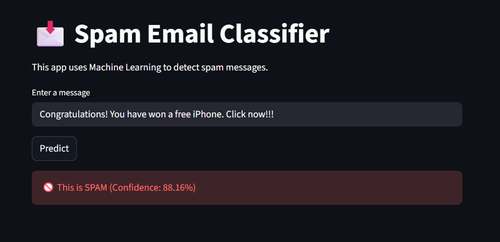

# 📩 Spam Email Classifier

A Machine Learning-based web application that detects whether a message is **Spam or Not Spam** using Natural Language Processing (NLP).

---

## 🌐 Live Demo

🔗 https://spam-classifier-nitish18.streamlit.app

---

## 📸 App Preview

---

## 🚀 Features

* Real-time spam detection
* Confidence score for predictions
* NLP-based text preprocessing
* Interactive web app using Streamlit

---

## 🧠 Tech Stack

* Python
* Pandas
* Scikit-learn
* Streamlit

---

## ⚙️ How It Works

1. Text is cleaned and preprocessed
2. Converted into numerical form using TF-IDF
3. Logistic Regression model predicts spam or not spam
4. Output is displayed with prediction result

---

## ▶️ Run Locally

### 1. Clone the repository

git clone https://github.com/pnitishkumar/spam-classifier.git

### 2. Navigate to project folder

cd spam-classifier

### 3. Install dependencies

pip install -r requirements.txt

### 4. Run the app

streamlit run app.py

---

## 📂 Project Structure

spam-classifier/
│
├── app.py
├── spam.csv
├── requirements.txt
├── README.md
└── screenshot.png

---

## 🎯 Future Improvements

* Improve model accuracy with larger dataset
* Use deep learning models (LSTM / BERT)
* Enhance UI design
* Add explanation for predictions

---

## 📌 Author

P. Nitish Kumar Reddy

---

## ⭐ Acknowledgement

This project is built as part of learning Machine Learning and NLP with real-world deployment using Streamlit.
